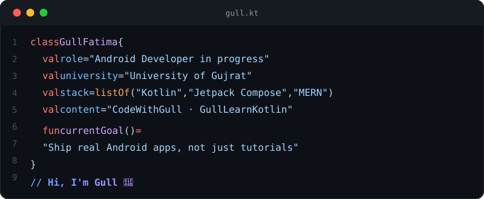

 

### 🧠 About Me

- 🎓 BSCS student at **University of Gujrat**, building toward a career as an **Android Developer**
- 👥 Lead a team at university — handle task delegation and workload distribution
- ✍️ Run **CodeWithGull** / **GullLearnKotlin** — Kotlin & Android educational content (slides, quizzes, design pattern breakdowns) on LinkedIn & Instagram
- 🧩 Studying Kotlin deeply: null safety, OOP, sealed/enum classes, generics, SOLID, and design patterns (Factory, Builder, Decorator, Observer, Strategy, State)
- 🏗️ Comfortable across the stack — Jetpack Compose (Android), MERN (Node/Express/MongoDB/React), MySQL
- 🎨 Design sensibility: dark, premium, VS Code–styled UI — JetBrains Mono everywhere

 

### 🛠️ Tech Stack

 

### 🚀 Projects

<table>
<tr>
<td width="50%" valign="top">

#### Calculator App
Android calculator built with XML layouts

</td>
<td width="50%" valign="top">

#### FoodieApp
Food delivery app UI — Jetpack Compose practice project

</td>
</tr>
<tr>
<td width="50%" valign="top">

#### Design-Pattern
Kotlin design patterns — Factory, Builder, Decorator, Observer, Strategy, State

</td>
<td width="50%" valign="top">

#### Solid-Principles
SOLID principles implemented in Kotlin

</td>
</tr>
<tr>
<td width="50%" valign="top">

#### Kotlin
Kotlin language practice & concepts

</td>
<td width="50%" valign="top">

#### Todo-App--Full-Stack
To-do list app — Node.js/Express backend, MongoDB, frontend

</td>
</tr>
<tr>
<td width="50%" valign="top">

#### Web-Development-Project
Web development project

</td>
<td width="50%" valign="top">

#### Clinical-Database-Management-System
Designed a relational database with normalized tables; SQL queries for CRUD operations, joins, and report generation

</td>
</tr>
<tr>
<td width="50%" valign="top">

#### Library-Management-System
Library management system

</td>
<td width="50%" valign="top">

#### Book-Reading-Tracker-App
Book reading tracker app

</td>
</tr>
<tr>
<td width="50%" valign="top">

#### JetPack-Compose-Practice
Component-by-component Jetpack Compose practice repo — layouts, dialogs, navigation, pickers, and more

</td>
</tr>
</table>

 

### 🌐 Open Source Contribution

Contributed to this project (not solely authored)

 

### 📊 Top Languages

 

### 🔗 Connect

 

Currently: deep in Kotlin design patterns, prepping for Android developer interviews.

